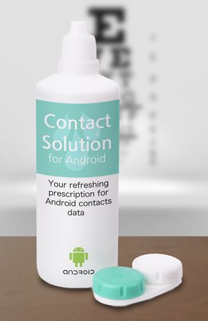

Contact Solution might _look_ like a joke that keeps getting cornea, but listen up my pupil, it's here to save you from having to figure out Android contacts in your RubyMotion project.

## Usage

How many contacts do you have?
```ruby
  mp ContactSolution.all.count
```

Read a phone number of a contact.
```ruby
  # Grab all phones for some contact
  some_contact = ContactSolution.all.first
  phones = some_contact.phones
  # Now read out the first phone (if it has at least 1)
  if phones.moveToFirst
    mp ContactSolution.read_number(phones)
  end
```

Get some phones!
```ruby
  # Grab ALL THE PHONES!!
  all_phones = ContactSolution.find_phones
```

Get mobile phone for a particular user.
```ruby
  # Give me the first mobile phone
  ContactSolution.get_number_by_type(some_phones, ContactSolution::PHONE_TYPE_MOBILE)
  # Give me the first home phone
  ContactSolution.get_number_by_type(contact.phones, ContactSolution::PHONE_TYPE_HOME)
  # Give me the first work phone
  ContactSolution.get_number_by_type(contact.phones, ContactSolution::PHONE_TYPE_WORK)
```

Annnnnd more functionality to come. :shipit:

## Installation

Add this line to your application's Gemfile:

    gem 'contact_solution'

And then execute:

    $ bundle
    
Don't forget to add the permission in your Rakefile: 

      app.permissions += [:read_contacts]


## Contributing

1. Fork it
2. Create your feature branch (`git checkout -b my-new-feature`)
3. Commit your changes (`git commit -am 'Add some feature'`)
4. Push to the branch (`git push origin my-new-feature`)
5. Put the lotion in the basket
6. Create new Pull Request
